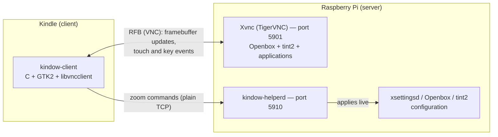

<div align="center">

# Kindow

**A jailbroken Kindle as a wireless touchscreen for your Raspberry Pi**

[](LICENSE)
-black)


*[Versão em português](docs/README.pt-BR.md)*


&nbsp;


</div>

Kindow puts your Raspberry Pi's desktop on a Kindle's e-ink screen, wirelessly. Tap to
click, type on an on-screen keyboard, drag windows, browse files, edit text — the
Kindle becomes a self-contained touch terminal for the Pi, launched straight from the
Kindle's own library. No cables, no extra hardware.

## Features

- **Full desktop, 1:1** — the Pi runs a real graphical session (window manager,
  taskbar, applications), sized automatically to fit the Kindle's screen exactly.
- **Everything by touch** — tap to click, dedicated right-click and drag keys, scroll
  buttons with adjustable speed, and an on-screen keyboard with sticky Shift/Ctrl
  (shortcuts like Ctrl+C work without multi-touch).
- **Readable at e-ink resolution** — three independent zoom levels (application
  content, window decorations, taskbar), adjusted live from the Kindle and remembered
  by the Pi across sessions.
- **Multiple servers** — a connection manager with history, one-tap reconnect, VNC
  password support, and clear error messages when a connection fails.
- **English and Portuguese** — the UI follows the Kindle's system language
  (Portuguese when the device is set to it, English otherwise).
- **E-ink friendly by design** — the screen only updates when content actually
  changes; there is no polling, no periodic refresh, no unnecessary redraw.

## A tour of the app

| Connection screen | New connection |
|:---:|:---:|
|  |  |
| *Saved servers, most recent first. One tap reconnects; "+" adds a new one.* | *IP, port and optional VNC password, typed on the built-in keyboard.* |

| Session | Menu |
|:---:|:---:|
|  |  |
| *The Pi's desktop with the keyboard open. The bottom bar is always available.* | *Zoom controls, scroll step, disconnect, connection status and quit.* |

<div align="center">


*When a connection fails, the app says so — and why — while retrying in the background.*
</div>

## Getting started

### What you need

- A **jailbroken Kindle** with scriptlet support (the standard mechanism of the
  [current jailbreak](https://kindlemodding.org/)). Developed and tested on a KT5
  (1072×1448); the proportional layout should adapt to other models, but they are
  unverified.
- A **Raspberry Pi** — or any Debian-like Linux with `systemd` — on the same network,
  reachable over SSH.

> **Quick install:** the [Releases page](https://github.com/duperez/kindow/releases)
> has a pre-built package with the Kindle binary, the launch scriptlet, the complete
> Pi server side and install scripts — no toolchain required. The steps below apply
> both to the package and to a repository checkout; building from source is only
> needed if you want to modify the client.

### Install the server (Pi)

```bash
scp -r pi/ pi@<pi-ip>:/tmp/kindow-pi && ssh -t pi@<pi-ip> 'bash /tmp/kindow-pi/install.sh'
```

The installer is idempotent: it installs the packages (TigerVNC, Openbox, tint2,
mousepad, xsettingsd), applies the session configuration without overwriting your
customizations, enables the two services and verifies that both respond.

### Install the client (Kindle)

From a release package, with root SSH access to the Kindle:

```bash
./install-kindle.sh <kindle-ip>
```

From a repository checkout (binary cross-compiled first, next section):

```bash
./kindle/deploy.sh <kindle-ip>
```

This installs the app and a "Kindow" item in the Kindle's library. From then on,
starting it is a tap — the Home screen lingers for about three seconds before the app
appears (a deliberate delay to win a race against the system's Home redraw), then the
connection screen comes up.

### Build the client from source

The client is C/GTK2, cross-compiled with Meson using the KindleModding toolchain
(koxtoolchain + KMC SDK) in a container — the
[KindleModding GTK tutorial](https://kindlemodding.org/kindle-dev/gtk-tutorial/)
covers the container setup. Then:

```bash
# Once: cross-compile the vendored libvncclient (submodule) into the toolchain sysroot
cd vendor/libvncserver && cmake -B build -S . \
  -DCMAKE_TOOLCHAIN_FILE=../../cmake/Toolchain-arm-kindlehf-linux-gnueabihf.cmake \
  -DCMAKE_BUILD_TYPE=Release -DCMAKE_INSTALL_PREFIX=<toolchain-sysroot>/usr \
  -DWITH_LIBVNCSERVER=OFF -DWITH_LIBVNCCLIENT=ON \
  -DWITH_GCRYPT=OFF -DWITH_OPENSSL=OFF -DWITH_GNUTLS=OFF -DWITH_JPEG=OFF -DWITH_PNG=OFF \
  -DBUILD_SHARED_LIBS=ON
cmake --build build && cmake --install build

# The application
cd app && meson setup build --cross-file <your-meson-crosscompile.txt> && ninja -C build
```

The pure modules have unit tests that run on any machine, no toolchain required:

```bash
cd app
cc -std=gnu11 -Wall -Wextra -Isrc src/connection_store.c tests/test_connection_store.c -o /tmp/t && /tmp/t
cc -std=gnu11 -Wall -Wextra -Isrc src/keyboard.c src/strings.c tests/test_keyboard.c -o /tmp/t && /tmp/t
cc -std=gnu11 -Wall -Wextra -Isrc src/pixel_convert.c tests/test_pixel_convert.c -o /tmp/t && /tmp/t
cc -std=gnu11 -Wall -Wextra -Isrc src/strings.c tests/test_strings.c -o /tmp/t && /tmp/t
```

## How it works

The Kindle and the Pi talk over two independent channels:



**Display and input** travel over the standard RFB (VNC) protocol. The Pi runs
TigerVNC in `Xvnc` mode — a virtual X display created for the Kindle, independent of
any monitor — and the client keeps a single persistent connection with an incremental
update request always in flight, so the server pushes changes only when something
actually changes on screen. This matches how e-ink wants to be treated: no traffic and
no redraw when the desktop is idle. Frames arrive ZRLE-compressed (chosen after
measuring a ~155× traffic reduction over raw encoding on text scrolling) and are
converted to grayscale on the client through a lookup table.

**Screen size is negotiated, not scaled.** On connect, the client asks the server to
resize the virtual display to exactly the Kindle's usable area (screen minus the bar
and keyboard) via the RFB `SetDesktopSize` extension, and asks again whenever the
keyboard is shown or hidden. The Pi therefore always renders at the native resolution
of whatever Kindle connected — pixels map 1:1, nothing is stretched.

**Zoom uses a separate side channel.** Font scale is not part of the VNC protocol, so
a small daemon on the Pi (`kindow-helperd`) accepts plain-TCP commands from the
Kindle's menu and applies them live: application content through XSETTINGS (`Xft/DPI`,
picked up immediately by GTK apps), window decorations through Openbox's
configuration, and the taskbar through tint2's. The three layers are independent, and
the chosen values persist on the Pi across sessions.

**Touch is translated, not emulated.** A tap becomes an RFB press+release pair at the
touched coordinate. Drag is explicit: arming the "Left" key makes the next touch a
real press-move-release sequence, throttled to avoid flooding the e-ink with
intermediate refreshes. Scroll buttons send wheel events at the last touched position.
What a drag *means* — moving a window, selecting text — is decided by the Pi's window
manager, exactly as it would be for a real mouse.

**The client is small and deliberately layered**: a protocol module (the only place
that touches `libvncclient`), a core session module (connection lifecycle, automatic
reconnection, resize policy), a GTK/Cairo presentation module, a device module for
Kindle-specific concerns (screensaver control, the window-title convention its window
manager requires), and pure, unit-tested modules for the keyboard layout, the
connection history and the pixel conversion. See [`app/src/`](app/src/).

## Known limitations

- **Portrait only** — landscape rotation is on the roadmap.
- **Grayscale, no dithering yet** — smooth gradients may show banding.
- **One validated model** — only the KT5 (1072×1448) has been tested.
- **Plain-text password storage** — saved VNC passwords live unencrypted on the
  Kindle's storage; anyone with physical or SSH access to the device can read them.
- **Screensaver recovery after a crash** — if the process dies without cleanup
  (SIGKILL), the Kindle's screensaver stays disabled until
  `lipc-set-prop -i com.lab126.powerd preventScreenSaver 0` or a reboot.
- **No transport encryption** — classic VNC authentication only, intended for a
  trusted local network. Do not expose these ports to the internet.

## Roadmap

- **Landscape orientation** — 90° rotation done client-side (pixels and touch
  coordinates), sidestepping the Kindle firmware's rotation lock.
- **Dithering** — investigate whether ordered dithering in the grayscale conversion
  visibly improves gradients on the 16-level panel.
- **Mirroring an existing session** — exploratory: switching from a dedicated virtual
  display to mirroring the Pi's physical monitor (`x11vnc`), if dynamic resize can be
  preserved.
- **The Kindle as a true second display** — exploratory, and possibly a dead end with
  standard tooling: making the Pi treat the Kindle as an additional Xrandr output
  rather than a separate session.
- **Screensaver watchdog** — automatic recovery of the screensaver setting after an
  abrupt crash, instead of the manual command.
- **Encrypted password storage** — limited value without OS keychain support, but
  worth evaluating.
- **Network discovery** — a UDP-broadcast "who's running kindow-helperd?" so new Pis
  can be found without typing an IP.
- **One-tap Pi setup** — bootstrapping a fresh Pi (install + services) over SSH from
  the Kindle's own connection form.

## License

[GPL-3.0](LICENSE). The vendored `libvncclient` is GPL-2.0-or-later; licensing the
project under GPL-3.0 keeps the repository consistent with its dependency.
