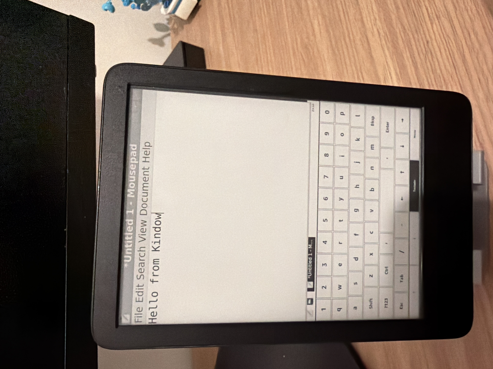
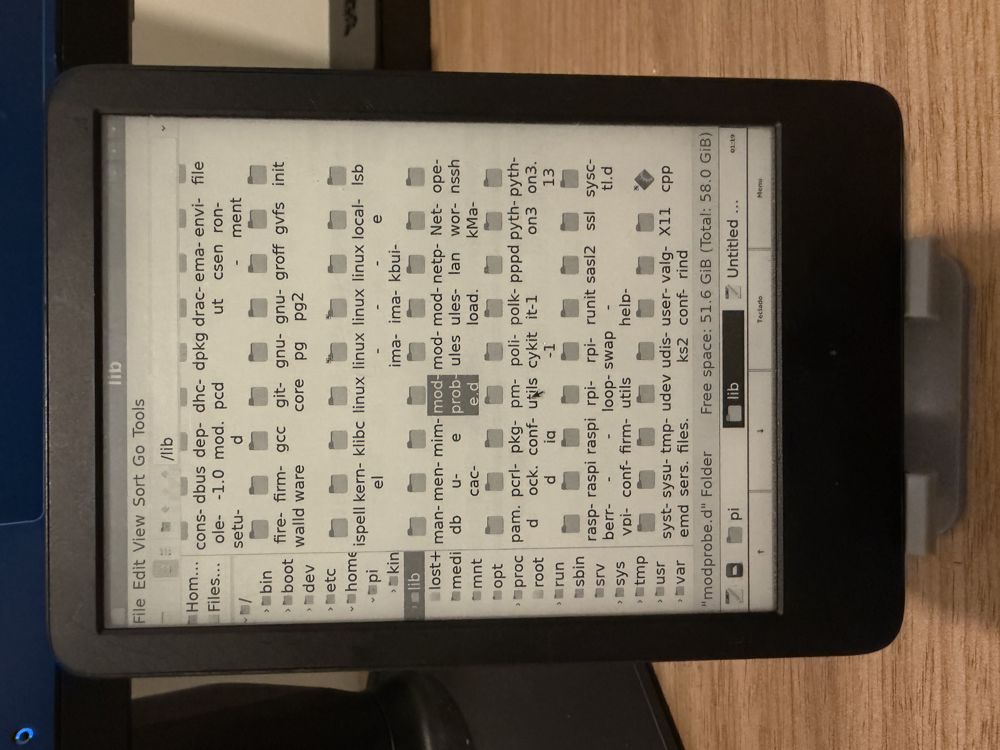
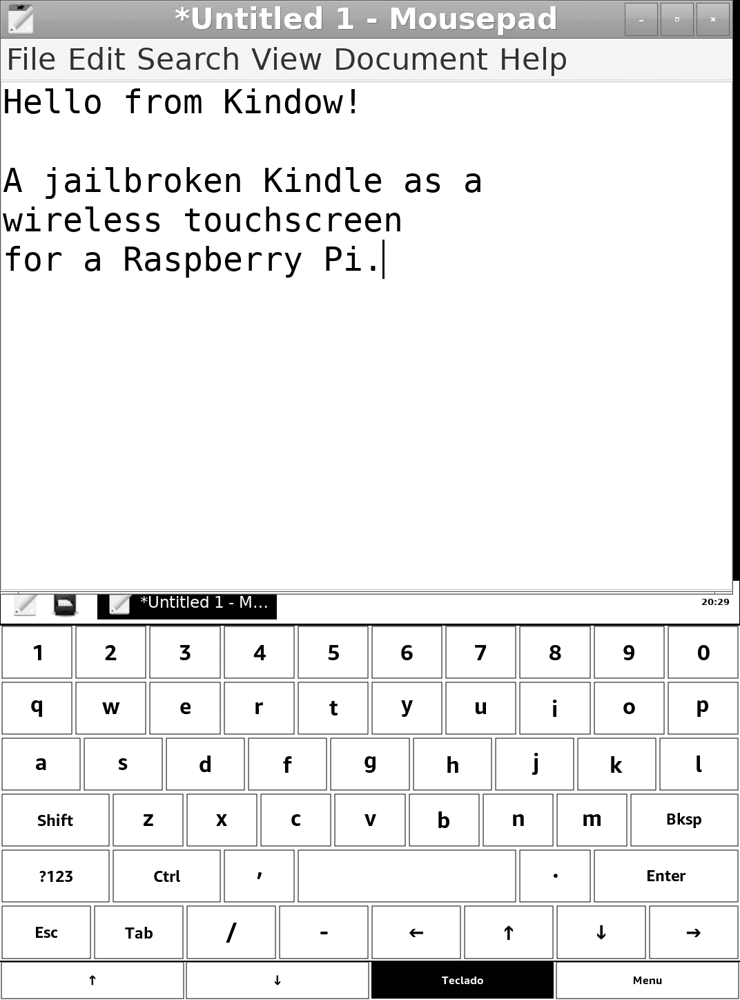
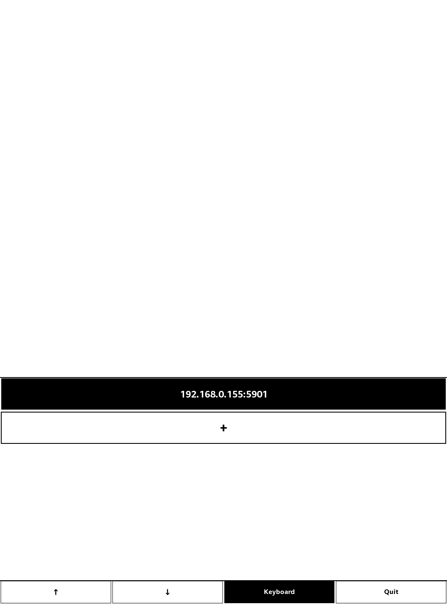

# Kindow

*[English version](../README.md) (a principal do repositório)*

Transforma um Kindle jailbreakado numa **tela de toque sem fio pra um Raspberry Pi**, via
VNC: o desktop do Pi aparece no e-ink do Kindle, e o toque na tela vira mouse/teclado de
volta — com atualização de tela só quando o conteúdo muda de verdade (um e-ink não
aguentaria refresh contínuo, e o protocolo RFB já é sob demanda por design).

<p align="center">
  
  &nbsp;&nbsp;
  
</p>

<p align="center">
  
  &nbsp;&nbsp;
  
</p>

*A foto é o device real; as duas imagens menores são capturas do framebuffer — exatamente
o que o e-ink mostra, pixel por pixel.*

**Status**: funcional de ponta a ponta em hardware real (Kindle KT5 + Raspberry Pi).
Nasceu como prova de conceito e ainda tem cara de PoC em vários cantos — mas o ciclo
completo (conectar, ver, tocar, digitar, arrastar) está validado no device físico.

## O que ele faz hoje

- **Desktop remoto interativo**: a sessão X do Pi (Openbox + tint2 + apps GTK)
  renderizada 1:1 no Kindle — a resolução remota se ajusta sozinha à tela de qualquer
  Kindle que conectar (`SetDesktopSize`), sem escala nem corte.
- **Toque = mouse**: toque vira clique esquerdo; a página de símbolos do teclado tem
  teclas dedicadas de clique **Esquerdo** (sticky — arma um clique contínuo/arrasto real,
  que termina quando o dedo levanta) e **Direito**.
- **Teclado virtual** com sticky Shift/Ctrl (chords tipo Ctrl+C funcionam sem
  multi-touch) e página de símbolos.
- **Barra fixa** no rodapé: scroll ↑/↓ (quantidade de "catracas" por toque ajustável),
  mostrar/esconder o teclado, e menu.
- **Menu**: zoom remoto em 3 camadas independentes (conteúdo dos apps via Xft/DPI,
  decoração de janela, painel), desconectar, status da conexão, sair.
- **Tela de conexão**: histórico dos Pis já usados (toque pra reconectar), formulário
  pra adicionar novo (IP/porta/senha), senha de VNC clássica suportada, e mensagens de
  erro de verdade quando a conexão não vinga.
- **Abre por toque** na biblioteca do Kindle (scriptlet "Kindow"), sem precisar de SSH.

## Requisitos

- **Kindle jailbreakado** com suporte a scriptlets (`.sh` tocável na biblioteca — o
  mecanismo padrão do [jailbreak moderno](https://kindlemodding.org/)). Testado num KT5
  (1072×1448); o layout é proporcional e deve se adaptar a outras resoluções, mas só o
  KT5 foi validado.
- **Raspberry Pi** (ou qualquer Linux Debian-like com `systemd`) na mesma rede, com SSH.
- Pra compilar o cliente: o toolchain de cross-compilation do KindleModding
  (koxtoolchain + KMC SDK) num container — ver "Compilando" abaixo.

## Instalando

### Lado Pi (servidor)

```bash
scp -r pi/ pi@<ip-do-pi>:/tmp/kindow-pi && ssh -t pi@<ip-do-pi> 'bash /tmp/kindow-pi/install.sh'
```

O [`install.sh`](../pi/install.sh) é idempotente (re-rodar é seguro): instala os pacotes
(TigerVNC, Openbox, tint2, mousepad, xsettingsd), aplica as configs da sessão sem
sobrescrever personalizações (zoom escolhido, `rc.xml` editado), instala e habilita os
dois serviços (`vnc-kindle` na porta 5901, `kindow-helperd` na 5910 — o canal lateral do
zoom) e verifica no final que ambos respondem.

### Lado Kindle (cliente)

Com o binário já cross-compilado (ver abaixo) e SSH root no Kindle:

```bash
./kindle/deploy.sh <ip-do-kindle>
```

Copia o binário + `libvncclient` pra `/mnt/us/kindow/`, instala o scriptlet
[`kindle/kindow.sh`](../kindle/kindow.sh) em `/mnt/us/documents/` (vira o item "Kindow"
tocável na biblioteca) e relança o app.

### Compilando o cliente

O cliente é C/GTK2 (o GTK que o firmware do Kindle traz), cross-compilado com Meson
dentro de um container com o toolchain do KindleModding — siga o
[tutorial de GTK do KindleModding](https://kindlemodding.org/kindle-dev/gtk-tutorial/)
pra montar o container (koxtoolchain + KMC SDK). Com ele de pé:

```bash
# uma vez: o libvncclient vendorizado (submódulo), cross-compilado e instalado no
# sysroot do toolchain — a receita completa e testada (todas as flags, o install no
# sysroot e a verificação) está em docs/findings/libvncclient-api.md
cd vendor/libvncserver && cmake -B build -S . \
  -DCMAKE_TOOLCHAIN_FILE=../../cmake/Toolchain-arm-kindlehf-linux-gnueabihf.cmake \
  -DCMAKE_BUILD_TYPE=Release -DCMAKE_INSTALL_PREFIX=<sysroot-do-toolchain>/usr \
  -DWITH_LIBVNCSERVER=OFF -DWITH_LIBVNCCLIENT=ON \
  -DWITH_GCRYPT=OFF -DWITH_OPENSSL=OFF -DWITH_GNUTLS=OFF -DWITH_JPEG=OFF -DWITH_PNG=OFF \
  -DBUILD_SHARED_LIBS=ON
cmake --build build && cmake --install build

# o app em si
cd app && meson setup build --cross-file <seu-meson-crosscompile.txt> && ninja -C build
```

Os testes unitários dos módulos puros rodam em qualquer máquina, sem toolchain:

```bash
cd app
cc -std=gnu11 -Wall -Wextra -Isrc src/connection_store.c tests/test_connection_store.c -o /tmp/t && /tmp/t
cc -std=gnu11 -Wall -Wextra -Isrc src/keyboard.c tests/test_keyboard.c -o /tmp/t && /tmp/t
cc -std=gnu11 -Wall -Wextra -Isrc src/pixel_convert.c tests/test_pixel_convert.c -o /tmp/t && /tmp/t
```

## Usando

1. Toque em **"Kindow"** na biblioteca do Kindle (a Home aparece por ~3s antes do app —
   é intencional, uma corrida com o redesenho da Home que o launcher precisa vencer).
2. **Tela de conexão**: toque num Pi já usado pra reconectar, ou no **"+"** pra digitar
   IP/porta/senha de um novo (senha em branco = servidor sem senha, o padrão do
   `install.sh`). Conexões que funcionaram entram no histórico
   (`/mnt/us/kindow/connections.txt` — a senha fica lá em texto simples, decisão
   documentada em [`app/src/connection_store.h`](../app/src/connection_store.h)).
3. **Na sessão**: toque interage direto com o desktop do Pi. A barra do rodapé alterna
   teclado/menu; a página `?123` do teclado tem os cliques Esquerdo (arrasto) e Direito.
4. **Sair/trocar de Pi**: menu → "Desconectar do Pi" volta pra tela de conexão; sem
   sessão ativa, o botão "Menu" da barra vira **"Sair"**.

## Limitações conhecidas

- **Só retrato** por enquanto — rotação pra paisagem está na fila
  ([`ideias-futuras.md`](ideias-futuras.md)).
- **Escala de cinza**: o cliente converte tudo pra 256 tons (e o painel e-ink só
  distingue de verdade uns 16). Sem dithering ainda — degradês suaves podem mostrar
  faixas.
- **Só o KT5 validado** (1072×1448). O layout é proporcional por design, mas nenhum
  outro modelo foi testado.
- **Screensaver pode ficar preso desligado** se o processo morrer sem limpeza
  (SIGKILL/crash): o app desliga o screensaver do Kindle enquanto roda e restaura em
  todo caminho normal de saída, mas nada roda depois de um SIGKILL. Recuperação:
  `lipc-set-prop -i com.lab126.powerd preventScreenSaver 0` (ou reboot).
- **~3s de espera** na abertura pela biblioteca, explicado acima.
- **Sem criptografia de VNC**: só a autenticação clássica, pensado pra rede local
  confiável. Não exponha essas portas pra internet.

## Arquitetura

Ports & Adapters leve — cada dependência externa isolada atrás de um módulo próprio:

- [`app/src/main.c`](../app/src/main.c) — só wiring: instancia os módulos e liga callbacks.
- [`app/src/session.c`](../app/src/session.c) — o núcleo: ciclo de vida da conexão
  (conectar, reconectar sozinho, watch do fd), política de resize, envio de
  clique/tecla/scroll/arrasto. Conhece GLib (event loop), não GTK nem VNC.
- [`app/src/ui.c`](../app/src/ui.c) — adapter de apresentação (GTK2/Cairo): janela, toque,
  barra, painel teclado/menu, telas de conexão. Não conhece VNC.
- [`app/src/vnc_client.c`](../app/src/vnc_client.c) — único módulo que fala com
  `libvncclient`.
- [`app/src/kindle_platform.c`](../app/src/kindle_platform.c) — específicos do device
  (screensaver via `lipc`, título mágico de janela, diretório de dados).
- Módulos puros e testáveis (zero GTK/VNC): [`keyboard.c`](../app/src/keyboard.c) (layout,
  hit-test, sticky keys), [`connection_store.c`](../app/src/connection_store.c) (histórico
  de conexões) e [`pixel_convert.c`](../app/src/pixel_convert.c) (cores → cinza).
- [`app/src/remote_control.c`](../app/src/remote_control.c) — cliente TCP do
  `kindow-helperd` (zoom remoto, fora do protocolo RFB).
- [`pi/`](../pi/) — o lado servidor completo (sessão X, serviços, instalador).
- [`kindle/`](../kindle/) — scriptlet de lançamento e script de deploy.
- [`vendor/libvncserver`](../vendor/libvncserver) — submódulo, pinado em 0.9.15.

## Documentação técnica

- [`docs/findings/`](findings/) — achados técnicos, um arquivo por
  problema/solução: protocolo RFB e encodings, API da libvncclient (e os bugs reais dela
  contornados), escolha do servidor VNC, e tudo que só o teste em hardware revelou.
- [`docs/ideias-futuras.md`](ideias-futuras.md) — a fila do que vem depois, com o
  raciocínio registrado antes de cada implementação.
- [`docs/historico-da-poc.md`](historico-da-poc.md) — o diário cronológico da PoC
  (o antigo conteúdo deste README), preservado como registro fiel de como o projeto
  chegou aqui.

## Licença

[GPL-3.0](../LICENSE). A escolha acompanha a dependência: o `libvncclient` vendorizado é
GPL-2.0+, então qualquer binário distribuído já herdaria os termos GPL de qualquer
jeito — licenciar o projeto inteiro como GPL é a opção coerente.
