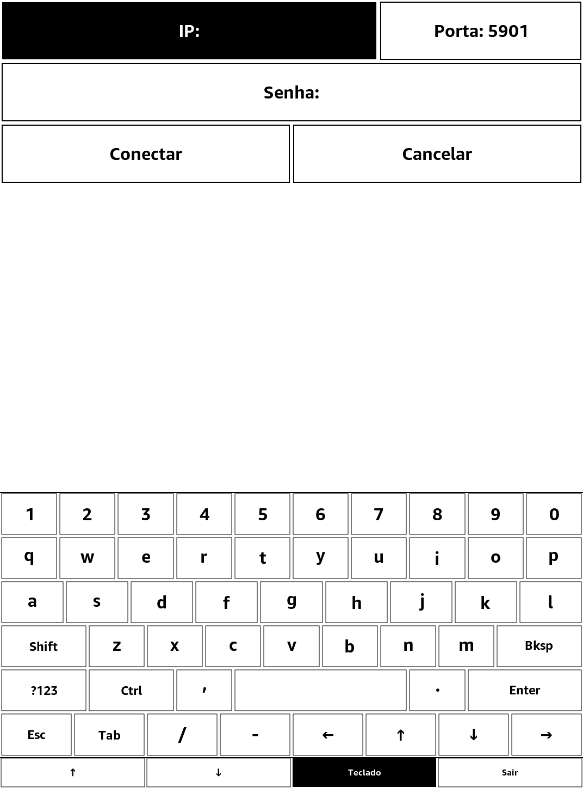
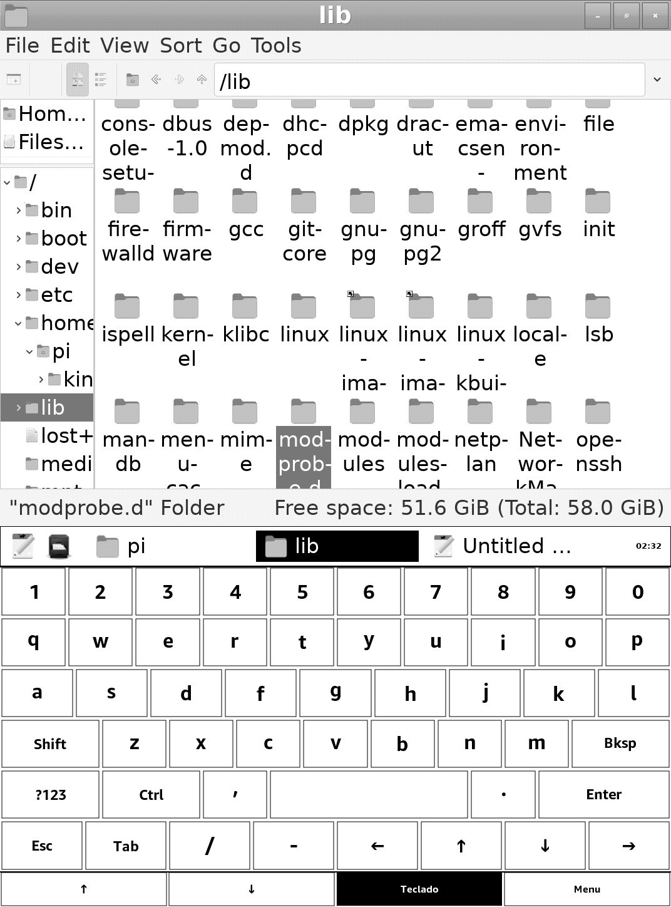
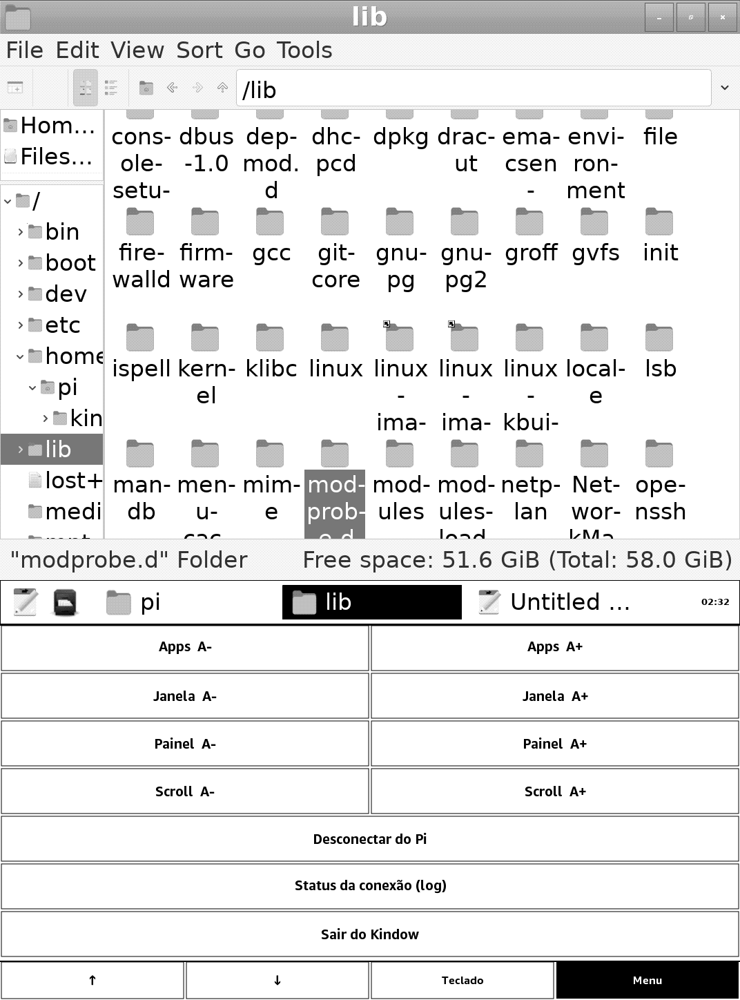
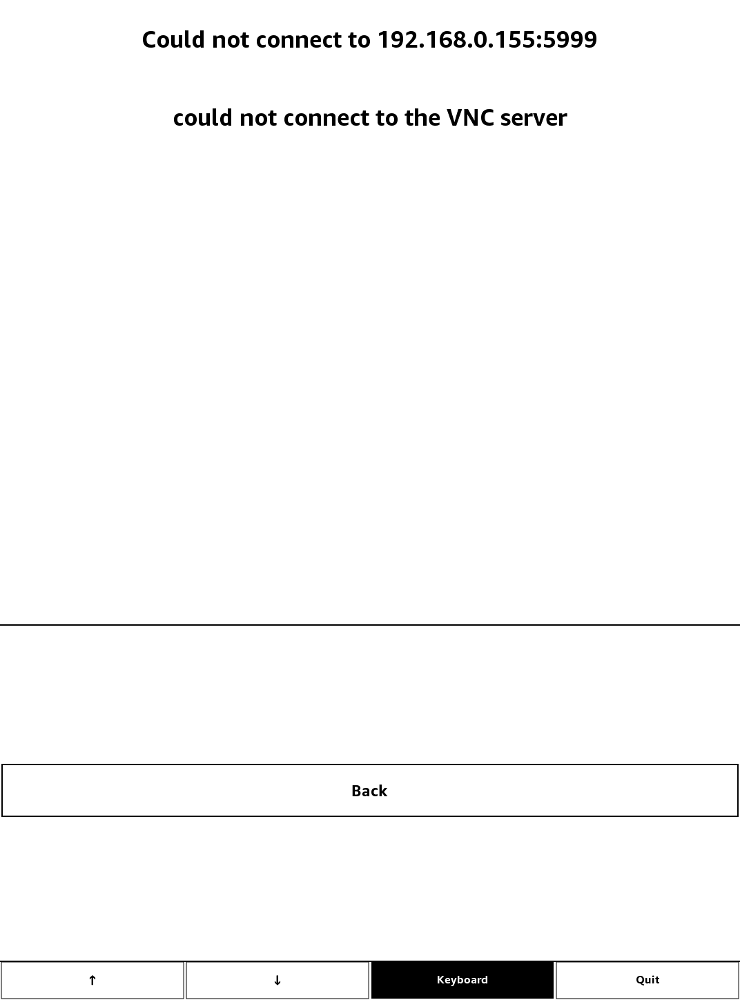
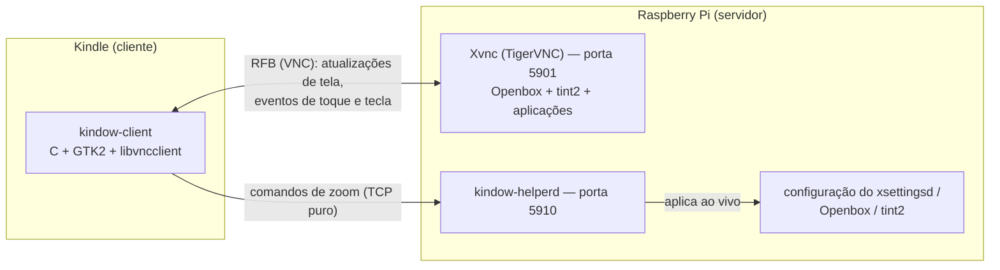

<div align="center">

# Kindow

**Um Kindle jailbreakado como tela de toque sem fio pro seu Raspberry Pi**

[](../LICENSE)
-black)


*[English version](../README.md) (a principal do repositório)*


&nbsp;


</div>

O Kindow coloca o desktop do seu Raspberry Pi na tela e-ink de um Kindle, sem fio.
Toque pra clicar, digite num teclado virtual, arraste janelas, navegue em arquivos,
edite texto — o Kindle vira um terminal de toque autocontido pro Pi, aberto direto da
biblioteca do próprio Kindle. Sem cabos, sem hardware extra.

## Funcionalidades

- **Desktop completo, 1:1** — o Pi roda uma sessão gráfica de verdade (window manager,
  taskbar, aplicações), dimensionada automaticamente pra caber exata na tela do
  Kindle.
- **Tudo por toque** — toque pra clicar, teclas dedicadas de clique direito e
  arrasto, botões de scroll com velocidade ajustável, e um teclado virtual com
  Shift/Ctrl sticky (atalhos como Ctrl+C funcionam sem multi-touch).
- **Legível na resolução do e-ink** — três níveis de zoom independentes (conteúdo das
  aplicações, decoração de janela, taskbar), ajustados ao vivo do Kindle e lembrados
  pelo Pi entre sessões.
- **Múltiplos servidores** — gerenciador de conexões com histórico, reconexão num
  toque, suporte a senha de VNC e mensagens claras de erro quando a conexão falha.
- **Inglês e português** — a UI segue o idioma do sistema do Kindle (português quando
  o device está configurado assim, inglês nos demais casos).
- **Amigável ao e-ink por design** — a tela só atualiza quando o conteúdo muda de
  verdade; não há polling, refresh periódico nem redesenho desnecessário.

## Um tour pelo app

| Tela de conexão | Nova conexão |
|:---:|:---:|
|  |  |
| *Servidores salvos, mais recente primeiro. Um toque reconecta; "+" adiciona um novo.* | *IP, porta e senha opcional de VNC, digitados no teclado embutido.* |

| Sessão | Menu |
|:---:|:---:|
|  |  |
| *O desktop do Pi com o teclado aberto. A barra do rodapé está sempre disponível.* | *Controles de zoom, passo do scroll, desconectar, status da conexão e sair.* |

<div align="center">


*Quando uma conexão falha, o app avisa — e diz o porquê — enquanto continua tentando
em segundo plano.*
</div>

## Começando

### O que você precisa

- Um **Kindle jailbreakado** com suporte a scriptlets (o mecanismo padrão do
  [jailbreak atual](https://kindlemodding.org/)). Desenvolvido e testado num KT5
  (1072×1448); o layout proporcional deve se adaptar a outros modelos, mas eles não
  foram verificados.
- Um **Raspberry Pi** — ou qualquer Linux Debian-like com `systemd` — na mesma rede,
  acessível por SSH.

### Instalar o servidor (Pi)

```bash
scp -r pi/ pi@<ip-do-pi>:/tmp/kindow-pi && ssh -t pi@<ip-do-pi> 'bash /tmp/kindow-pi/install.sh'
```

O instalador é idempotente: instala os pacotes (TigerVNC, Openbox, tint2, mousepad,
xsettingsd), aplica a configuração da sessão sem sobrescrever personalizações,
habilita os dois serviços e verifica que ambos respondem.

### Instalar o cliente (Kindle)

Com o binário cross-compilado (próxima seção) e acesso SSH root ao Kindle:

```bash
./kindle/deploy.sh <ip-do-kindle>
```

Isso instala o app e um item "Kindow" na biblioteca do Kindle. Daí em diante, abrir é
um toque — a tela inicial do Kindle permanece uns três segundos antes do app aparecer
(um atraso deliberado, pra vencer uma corrida com o redesenho da tela inicial do
sistema), e então a tela de conexão aparece.

### Compilar o cliente do zero

O cliente é C/GTK2, cross-compilado com Meson usando o toolchain do KindleModding
(koxtoolchain + KMC SDK) num container — o
[tutorial de GTK do KindleModding](https://kindlemodding.org/kindle-dev/gtk-tutorial/)
cobre a montagem do container. Depois:

```bash
# Uma vez: cross-compilar o libvncclient vendorizado (submódulo) pro sysroot do toolchain
cd vendor/libvncserver && cmake -B build -S . \
  -DCMAKE_TOOLCHAIN_FILE=../../cmake/Toolchain-arm-kindlehf-linux-gnueabihf.cmake \
  -DCMAKE_BUILD_TYPE=Release -DCMAKE_INSTALL_PREFIX=<sysroot-do-toolchain>/usr \
  -DWITH_LIBVNCSERVER=OFF -DWITH_LIBVNCCLIENT=ON \
  -DWITH_GCRYPT=OFF -DWITH_OPENSSL=OFF -DWITH_GNUTLS=OFF -DWITH_JPEG=OFF -DWITH_PNG=OFF \
  -DBUILD_SHARED_LIBS=ON
cmake --build build && cmake --install build

# A aplicação
cd app && meson setup build --cross-file <seu-meson-crosscompile.txt> && ninja -C build
```

Os módulos puros têm testes unitários que rodam em qualquer máquina, sem toolchain:

```bash
cd app
cc -std=gnu11 -Wall -Wextra -Isrc src/connection_store.c tests/test_connection_store.c -o /tmp/t && /tmp/t
cc -std=gnu11 -Wall -Wextra -Isrc src/keyboard.c src/strings.c tests/test_keyboard.c -o /tmp/t && /tmp/t
cc -std=gnu11 -Wall -Wextra -Isrc src/pixel_convert.c tests/test_pixel_convert.c -o /tmp/t && /tmp/t
cc -std=gnu11 -Wall -Wextra -Isrc src/strings.c tests/test_strings.c -o /tmp/t && /tmp/t
```

## Como funciona

O Kindle e o Pi conversam por dois canais independentes:



**Tela e entrada** viajam pelo protocolo RFB (VNC) padrão. O Pi roda o TigerVNC em
modo `Xvnc` — um display X virtual criado pro Kindle, independente de qualquer
monitor — e o cliente mantém uma única conexão persistente com um pedido incremental
de atualização sempre em andamento, então o servidor só transmite quando algo muda de
verdade na tela. É exatamente como o e-ink quer ser tratado: sem tráfego e sem
redesenho enquanto o desktop está parado. Os frames chegam comprimidos em ZRLE
(escolhido depois de medir ~155× menos tráfego que o encoding raw num scroll de
texto) e são convertidos pra escala de cinza no cliente por uma lookup table.

**O tamanho da tela é negociado, não escalado.** Ao conectar, o cliente pede ao
servidor pra redimensionar o display virtual pra exatamente a área útil do Kindle
(tela menos barra e teclado), via a extensão `SetDesktopSize` do RFB — e pede de novo
sempre que o teclado é mostrado ou escondido. O Pi sempre renderiza na resolução
nativa do Kindle que conectou; os pixels mapeiam 1:1, nada é esticado.

**O zoom usa um canal lateral próprio.** Escala de fonte não faz parte do protocolo
VNC, então um daemon pequeno no Pi (`kindow-helperd`) aceita comandos TCP simples
vindos do menu do Kindle e os aplica ao vivo: o conteúdo das aplicações via XSETTINGS
(`Xft/DPI`, absorvido na hora pelos apps GTK), a decoração de janela via a
configuração do Openbox, e a taskbar via a do tint2. As três camadas são
independentes, e os valores escolhidos persistem no Pi entre sessões.

**O toque é traduzido, não emulado.** Um toque vira um par press+release RFB na
coordenada tocada. O arrasto é explícito: armar a tecla "Esquerdo" faz o próximo
toque virar uma sequência real de press-move-release, com throttle pra não inundar o
e-ink de refreshes intermediários. Os botões de scroll mandam eventos de roda na
última posição tocada. O que um arrasto *significa* — mover janela, selecionar
texto — é decidido pelo window manager do Pi, exatamente como seria com um mouse de
verdade.

**O cliente é pequeno e deliberadamente estratificado**: um módulo de protocolo (o
único lugar que toca a `libvncclient`), um núcleo de sessão (ciclo de vida da
conexão, reconexão automática, política de resize), um módulo de apresentação
GTK/Cairo, um módulo de device pras particularidades do Kindle (controle do
screensaver, a convenção de título de janela que o window manager dele exige) e
módulos puros com testes unitários pro layout do teclado, o histórico de conexões e a
conversão de pixel. Ver [`app/src/`](../app/src/).

## Limitações conhecidas

- **Só retrato** — rotação pra paisagem está no roadmap.
- **Escala de cinza, sem dithering ainda** — degradês suaves podem apresentar faixas.
- **Um modelo validado** — só o KT5 (1072×1448) foi testado.
- **Senha guardada em texto simples** — senhas de VNC salvas ficam sem criptografia
  no armazenamento do Kindle; quem tem acesso físico ou SSH ao device consegue lê-las.
- **Recuperação do screensaver após crash** — se o processo morrer sem limpeza
  (SIGKILL), o screensaver do Kindle fica desligado até rodar
  `lipc-set-prop -i com.lab126.powerd preventScreenSaver 0` ou reiniciar.
- **Sem criptografia de transporte** — só a autenticação VNC clássica, pensada pra
  rede local confiável. Não exponha essas portas pra internet.

## Roadmap

- **Orientação paisagem** — rotação de 90° feita no cliente (pixels e coordenadas de
  toque), contornando o bloqueio de rotação do firmware do Kindle.
- **Dithering** — investigar se dithering ordenado na conversão de cinza melhora
  visivelmente os degradês no painel de 16 níveis.
- **Espelhar uma sessão existente** — exploratório: trocar o display virtual dedicado
  pelo espelhamento do monitor físico do Pi (`x11vnc`), se o resize dinâmico puder
  ser preservado.
- **O Kindle como segunda tela de verdade** — exploratório, possivelmente um beco sem
  saída com ferramentas padrão: fazer o Pi tratar o Kindle como uma saída Xrandr
  adicional em vez de uma sessão separada.
- **Watchdog do screensaver** — recuperação automática do screensaver depois de um
  crash abrupto, no lugar do comando manual.
- **Senha criptografada** — valor limitado sem keychain no sistema, mas vale avaliar.
- **Descoberta na rede** — um broadcast UDP "quem está rodando kindow-helperd?" pra
  achar Pis novos sem digitar IP.
- **Setup do Pi num toque** — provisionar um Pi virgem (instalação + serviços) via
  SSH a partir do próprio formulário de conexão do Kindle.

## Licença

[GPL-3.0](../LICENSE). A `libvncclient` vendorizada é GPL-2.0-or-later; licenciar o
projeto como GPL-3.0 mantém o repositório consistente com a dependência.
